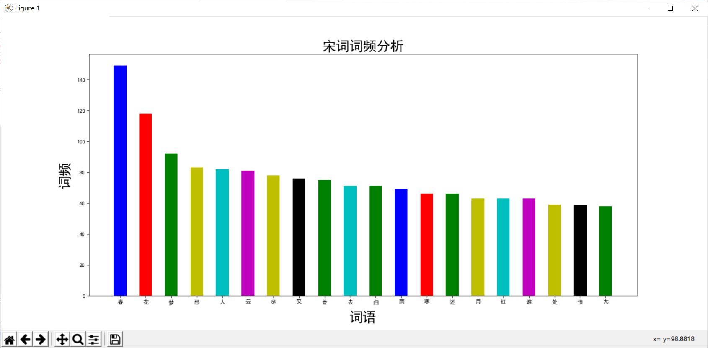

# 宋词词频分析

### 分析统计图

### 导入相关库，jieba库用于分词，matplotlib库用于绘制柱形图
import jieba     
import matplotlib  
import matplotlib.pyplot as plt  
## 文件读取并分词部分
### 打开需要分词的文件并读取内容
filename = '附件1：《宋词三百首》.txt'
file = open(filename,'r')		# 以可读方式打开文件
### 读取文件内容并把所有标点符号改为逗号便于分词管理
content = file.read().replace("，",",").replace("！",",").replace("“",",")\
            .replace("”",",").replace("。",",").replace("？",",").replace("：",",")\
            .replace("...",",").replace("、",",").replace('\u3000',',')\
            .replace(' ',',').replace('\n','').replace('-',',').strip()	
file.close() # 关闭文件

words =jieba.cut(content,cut_all=True)		# 利用jieba库进行精确模式分词，生成一个可迭代的数据
counts = {}		# 创建用来存储词和词频的字典

## 将分词后的词存储到字典，并进行词频统计
for word in words:
    if ',' not in word:
        counts[word] = counts.get(word,0) + 1

items = list(counts.items())		# 将字典键对数据进行列表化
items.sort(key=lambda x:x[1], reverse =True)		# 按词频大小进行降序排序
print(items[:20])		# 打印出词频前20的详细数据，清晰展示
x_word,y = [],[]		# 创建两个空列表分开储存前20的数据

## 对items列表进行循环，分开储存数据到x_word,y列表中
for i in items[:20]:
    x_word.append(i[0])
y.append(i[1])
## 将分词结果绘制柱形图部分
matplotlib.rcParams['font.sans-serif'] = ['SimHei']	# 设置matplotlib正常显示中文
plt.figure(figsize=(18,8),dpi=75)		# 生成合适大小的画布
x = range(len(x_word))	
plt.title('宋词词频分析',fontsize=25)		# 设置柱形图标题和字体大小
plt.xlabel('词语',fontsize=25,labelpad=10)	# 设置横坐标标题、字体大小和轴距离
plt.ylabel('词频',fontsize=25,labelpad=10)	# 设置纵坐标标题、字体大小和轴距离
plt.bar(x,y,width=0.5,color=['b','r','g','y','c','m','y','k','g','c','g']) 	     # 绘图，设置宽度和颜色
plt.xticks(x,x_word)		# 将横坐标替换成词语名
plt.show()			# 展示柱形图
